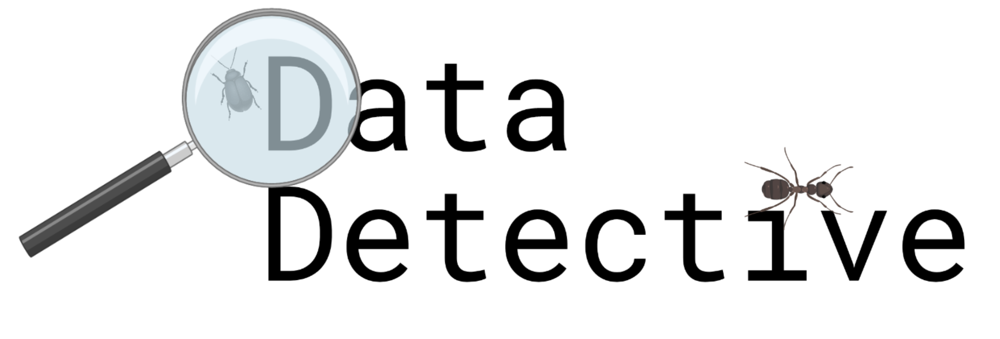

# Data Detective

Data Detective is an open-source, modular, extensible validation framework for identifying potential issues with heterogeneous, multimodal data.

## Examples of issues that are in scope for Data Detective to detect
- Do splits used for model training come from othe same distribution?
- Are there any anomalies present in the dataset?
- Are the conditional independences we expect in the data obeyed?
- Are the datapoints at inference in the same distribution as what we have used to train/test the model?
- Are there near or exact duplicates present within the dataset?
- Are there mislabeled samples present within the dataset?

# Workflow


## Installation Steps
After cloning the repository and `cd`'ing into the directory, run the following commands. 

```bash
# install packages supporting rank aggregation
git clone https://github.com/thelahunginjeet/pyrankagg.git
git clone https://github.com/thelahunginjeet/kbutil.git

# install all other packages
virtualenv dd_env -p python3.9 
source dd_env/bin/activate
pip3 install -r requirements.txt
dd_env/bin/python -m ipykernel install --name=dd_env 
```

If you are planning on using Data Detective in a jupyter notebook, please ensure that the kernel is switched to the appropriate virtual environoment.

If you are planning to make use of the pretrained transform library for high dimensional inputs, follow the additional install steps outlined below.

```bash
# for huggingface hosted models
pip install transformers

```

## Quickstart

To get started as quickly as possible, please see Quickstart.ipynb in the root directory of this repo.


# Contributing

To contribute to Data Detective, please first complete the `ExtendingDD` jupyter notebook to learn more about 
how to extend Data Detective to add new validator methods, validators, and validator methods to the Data Detective 
ecosystem. To submit a contribution, issue a pull request containing the contribution as well as any relevant
tests guaranteeing functionality of the implementation. All pull requests must be approved by at least one Data Detective 
administrator before being merged into the master branch. 

There should be at least one test attached to each validator method / transform. All submitted code should be 
well-documented and follow the PEP-8 standard. 
